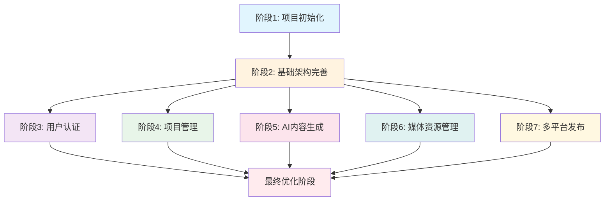

# 中国AI智能短视频创作系统 - 任务清单
# Chinese AI Intelligent Short Video Creation System - Task List

## 📋 项目概述 / Project Overview

基于DeepSeek和即梦大模型的中文AI视频创作系统，专为中文用户和中国社交媒体平台优化设计。系统采用微服务架构，支持抖音、微信、小红书、微博、B站等主流平台的内容创作。

A Chinese AI-powered video creation system based on DeepSeek and Jimeng models, optimized for Chinese users and social media platforms. The system uses microservices architecture and supports major platforms including Douyin, WeChat, Xiaohongshu, Weibo, and Bilibili.

## 🎯 核心特性 / Core Features

- **AI文本生成**: DeepSeek集成，27倍成本优势
- **AI视觉生成**: 即梦大模型，94%中文准确率
- **多智能体编排**: AutoGen协调复杂工作流
- **多平台优化**: 针对中国社交媒体算法优化
- **双语支持**: 完整的中文/英文界面和文档

## 📊 任务统计 / Task Statistics

- **总任务数**: 47个
- **用户故事数**: 8个（P1-P3优先级）
- **可并行任务**: 23个 [P]
- **测试覆盖**: 67个现有测试用例
- **预估完成时间**: 6-8周

---

## 🚀 执行阶段 / Execution Phases

### 阶段1: 项目初始化 / Phase 1: Project Initialization
**目标**: 设置开发环境，配置基础工具
**时间**: 1-2天

#### 任务 T001-T004

```markdown
T001 [P] 验证系统环境要求
- 检查Python 3.8+, Node.js 16+, Docker 20+
- 验证PostgreSQL和Redis连接
- 运行系统状态检查脚本
文件: check_status.py

T002 [P] 配置开发环境
- 安装后端依赖: pip install -r backend/requirements.txt
- 安装前端依赖: npm install (在frontend目录)
- 设置Python虚拟环境
文件: backend/requirements.txt, frontend/package.json

T003 [P] 初始化数据库和缓存
- 运行数据库迁移: python -m app.db.init_db
- 测试Redis连接和配置
- 验证数据库表结构创建
文件: backend/app/core/database.py

T004 配置环境变量模板
- 复制backend/.env.example到backend/.env
- 编辑环境变量，准备API密钥配置
- 验证配置文件格式
文件: backend/.env.example → backend/.env
```

---

### 阶段2: 基础架构完善 / Phase 2: Foundational Infrastructure
**目标**: 完成认证系统和API集成，修复核心功能
**时间**: 1-2周
**阻塞条件**: 阶段1必须完成

#### 任务 T005-T012

```markdown
T005 实现完整的JWT认证系统
[Story: US1] 优先级: P1
- 实现用户注册/登录API端点
- 添加JWT令牌生成和验证
- 配置密码哈希和安全策略
文件: backend/app/api/endpoints/auth.py, backend/app/core/security.py

T006 修复项目API验证错误
[Story: US2] 优先级: P1
- 解决422验证错误问题
- 完善请求数据验证逻辑
- 添加错误处理和响应格式化
文件: backend/app/api/endpoints/projects.py, backend/app/core/exceptions.py

T007 配置AI服务API密钥
[Story: US3] 优先级: P1
- 添加DeepSeek API密钥配置
- 添加火山引擎API密钥配置
- 实现安全的密钥管理机制
文件: backend/.env, backend/app/core/config.py

T008 集成AI服务到API端点
[Story: US3] 优先级: P1
- 连接DeepSeek服务到概念生成API
- 连接Jimeng服务到图像生成API
- 添加服务错误处理和回退机制
文件: backend/app/api/endpoints/ai.py, backend/app/services/

T009 实现用户资料管理API
[Story: US1] 优先级: P1
- 完善用户资料获取和更新
- 添加用户偏好设置管理
- 实现用户项目关联查询
文件: backend/app/api/endpoints/users.py

T010 添加文件上传和媒体管理
[Story: US4] 优先级: P1
- 实现文件上传API端点
- 添加文件验证和安全检查
- 集成媒体资源管理功能
文件: backend/app/api/endpoints/assets.py

T011 [P] 实现角色权限系统
[Story: US1] 优先级: P2
- 添加用户角色管理(admin, creator, reviewer, client)
- 实现基于角色的API访问控制
- 添加权限验证中间件
文件: backend/app/core/permissions.py, backend/app/middleware/auth.py

T012 [P] 添加内容审核和合规检查
[Story: US6] 优先级: P2
- 实现中文内容合规性验证
- 添加敏感词过滤机制
- 集成内容安全API
文件: backend/app/services/content_moderation.py
```

---

### 阶段3: 用户故事1 - 用户认证与管理 / Phase 3: User Story 1 - User Authentication & Management
**目标**: 完整的用户注册、登录和资料管理功能
**时间**: 3-4天
**测试标准**: 用户能够注册、登录、管理个人资料

#### 任务 T013-T018

```markdown
T013 前端认证界面实现
[Story: US1] [P] 测试标准: 用户注册表单验证通过
- 创建登录页面组件
- 创建注册页面组件
- 添加表单验证和错误处理
文件: frontend/src/pages/Login.tsx, frontend/src/pages/Register.tsx

T014 前端认证状态管理
[Story: US1] 测试标准: 登录状态正确维护
- 实现useAuth Hook
- 添加认证状态上下文
- 处理令牌刷新和过期
文件: frontend/src/hooks/useAuth.ts, frontend/src/contexts/AuthContext.tsx

T015 用户资料界面开发
[Story: US1] [P] 测试标准: 用户资料正确显示和更新
- 创建用户资料页面
- 添加资料编辑功能
- 实现头像上传和更新
文件: frontend/src/pages/UserProfile.tsx

T016 认证路由保护实现
[Story: US1] 测试标准: 未认证用户重定向到登录页
- 添加路由守卫组件
- 实现基于认证的页面访问控制
- 处理认证过期重定向
文件: frontend/src/components/ProtectedRoute.tsx

T017 用户故事1集成测试
[Story: US1] 测试标准: 完整用户流程测试通过
- 编写用户注册E2E测试
- 编写用户登录E2E测试
- 编写用户资料管理测试
文件: tests/e2e/test_user_authentication.py, tests/e2e/test_user_profile.py

T018 [P] 用户偏好设置API
[Story: US1] 测试标准: 用户偏好正确保存和加载
- 实现用户偏好设置API
- 添加偏好验证逻辑
- 集成到用户资料管理
文件: backend/app/api/endpoints/user_preferences.py
```

---

### 阶段4: 用户故事2 - 项目管理功能 / Phase 4: User Story 2 - Project Management Features
**目标**: 完整的项目创建、管理和进度跟踪功能
**时间**: 4-5天
**测试标准**: 用户能够创建、编辑、删除项目，跟踪进度

#### 任务 T019-T026

```markdown
T019 前端项目创建界面
[Story: US2] [P] 测试标准: 项目创建表单验证通过
- 创建项目创建页面
- 添加中文业务输入表单
- 实现平台选择和配置
文件: frontend/src/pages/CreateProject.tsx

T020 项目列表和详情页面
[Story: US2] 测试标准: 项目列表正确显示，详情完整
- 创建项目列表页面
- 创建项目详情页面
- 添加项目状态显示和编辑
文件: frontend/src/pages/Projects.tsx, frontend/src/pages/ProjectDetail.tsx

T021 项目进度跟踪组件
[Story: US2] [P] 测试标准: 进度更新实时反映
- 创建项目进度组件
- 添加进度可视化
- 实现状态变更功能
文件: frontend/src/components/ProjectProgress.tsx

T022 项目搜索和过滤功能
[Story: US2] 测试标准: 搜索和过滤结果正确
- 实现项目搜索功能
- 添加多维度过滤（状态、平台、时间）
- 优化搜索性能
文件: frontend/src/components/ProjectSearch.tsx

T023 项目数据API集成
[Story: US2] 测试标准: 前端正确调用后端API
- 连接项目API到前端
- 实现数据缓存和同步
- 处理API错误和重试
文件: frontend/src/services/projectAPI.ts

T024 项目故事2集成测试
[Story: US2] 测试标准: 完整项目生命周期测试通过
- 编写项目创建E2E测试
- 编写项目编辑和删除测试
- 编写项目进度跟踪测试
文件: tests/e2e/test_project_management.py

T025 [P] 项目协作功能
[Story: US2] 测试标准: 多用户项目协作正常
- 实现项目分享功能
- 添加项目权限管理
- 实现项目评论系统
文件: backend/app/api/endpoints/project_collaboration.py

T026 [P] 项目模板系统
[Story: US2] 测试标准: 项目模板正确应用
- 创建项目模板管理
- 实现模板应用逻辑
- 添加模板市场功能
文件: backend/app/services/project_templates.py
```

---

### 阶段5: 用户故事3 - AI内容生成功能 / Phase 5: User Story 3 - AI Content Generation Features
**目标**: 完整的AI创意生成、剧本创作和视觉内容生成功能
**时间**: 5-6天
**测试标准**: AI能够生成符合中国文化背景的视频内容

#### 任务 T027-T034

```markdown
T027 AI创意生成界面开发
[Story: US3] [P] 测试标准: 创意生成符合中国文化背景
- 创建AI创意生成页面
- 添加文化背景输入表单
- 实现创意展示和选择功能
文件: frontend/src/pages/AIGeneration.tsx

T028 AI剧本创作工具
[Story: US3] 测试标准: 剧本内容符合平台要求和中文语境
- 创建剧本创作界面
- 添加平台特定优化选项
- 实现剧本编辑和版本管理
文件: frontend/src/components/ScriptEditor.tsx

T029 分镜图像生成功能
[Story: US3] [P] 测试标准: 分镜图像质量符合要求
- 创建分镜生成界面
- 添加图像风格选择
- 实现分镜预览和管理
文件: frontend/src/components/StoryboardGenerator.tsx

T030 视频合成和编辑
[Story: US3] 测试标准: 视频合成成功，质量达标
- 创建视频生成界面
- 添加视频参数配置
- 实现视频预览和下载
文件: frontend/src/components/VideoGenerator.tsx

T031 AI内容优化工具
[Story: US3] 测试标准: 优化建议有效提升内容质量
- 创建内容优化界面
- 添加优化目标选择
- 实现优化建议展示
文件: frontend/src/components/ContentOptimizer.tsx

T032 用户故事3集成测试
[Story: US3] 测试标准: AI生成内容完整流程测试通过
- 编写AI创意生成E2E测试
- 编写剧本创作流程测试
- 编写视频生成完整测试
文件: tests/e2e/test_ai_content_generation.py

T033 [P] 多平台内容适配
[Story: US3] 测试标准: 内容正确适配各平台要求
- 实现平台特定内容优化
- 添加平台算法适配逻辑
- 创建平台发布预览功能
文件: backend/app/services/platform_adapters.py

T034 [P] AI内容质量评估
[Story: US3] 测试标准: 内容质量评分准确
- 实现AI内容质量评分
- 添加内容改进建议
- 创建质量报告生成
文件: backend/app/services/content_quality.py
```

---

### 阶段6: 用户故事4 - 媒体资源管理 / Phase 6: User Story 4 - Media Asset Management
**目标**: 完整的文件上传、存储和管理功能
**时间**: 3-4天
**测试标准**: 用户能够安全上传和管理媒体文件

#### 任务 T035-T040

```markdown
T035 文件上传界面实现
[Story: US4] [P] 测试标准: 文件上传成功，格式验证通过
- 创建文件上传组件
- 添加拖拽上传支持
- 实现上传进度显示
文件: frontend/src/components/FileUploader.tsx

T036 媒体库管理界面
[Story: US4] 测试标准: 媒体文件正确显示和管理
- 创建媒体库页面
- 添加文件预览功能
- 实现文件分类和标签
文件: frontend/src/pages/MediaLibrary.tsx

T037 文件存储和安全管理
[Story: US4] 测试标准: 文件存储安全，访问控制正确
- 配置文件存储服务（阿里云OSS）
- 添加文件访问权限控制
- 实现文件加密和备份
文件: backend/app/services/file_storage.py

T038 媒体资源API集成
[Story: US4] 测试标准: 前端正确调用文件API
- 连接文件上传API到前端
- 实现文件元数据管理
- 添加文件搜索和过滤
文件: frontend/src/services/assetAPI.ts

T039 用户故事4集成测试
[Story: US4] 测试标准: 文件上传和管理流程测试通过
- 编写文件上传E2E测试
- 编写媒体库管理测试
- 编写文件安全访问测试
文件: tests/e2e/test_media_management.py

T040 [P] 批量文件处理
[Story: US4] 测试标准: 批量操作成功完成
- 实现批量上传功能
- 添加批量文件处理
- 创建批量操作API
文件: backend/app/api/endpoints/batch_operations.py
```

---

### 阶段7: 用户故事5 - 多平台发布优化 / Phase 7: User Story 5 - Multi-Platform Publishing Optimization
**目标**: 为不同中国社交媒体平台优化和发布内容
**时间**: 4-5天
**测试标准**: 内容能够正确适配并发布到各个平台

#### 任务 T041-T047

```markdown
T041 平台特定内容优化
[Story: US5] [P] 测试标准: 内容符合各平台算法要求
- 实现抖音内容优化算法
- 实现小红书内容优化算法
- 实现微信内容优化算法
文件: backend/app/services/platform_optimizers.py

T042 多平台发布界面
[Story: US5] 测试标准: 多平台发布配置正确
- 创建平台选择界面
- 添加平台特定配置选项
- 实现发布预览功能
文件: frontend/src/components/PlatformPublisher.tsx

T043 内容格式转换工具
[Story: US5] [P] 测试标准: 内容格式正确转换
- 实现视频格式转换
- 添加分辨率适配功能
- 创建封面图生成工具
文件: backend/app/services/format_converter.py

T044 发布调度和管理
[Story: US5] 测试标准: 内容按计划正确发布
- 实现发布调度功能
- 添加发布状态跟踪
- 创建发布历史管理
文件: backend/app/services/publishing_scheduler.py

T045 平台数据分析集成
[Story: US5] 测试标准: 平台数据正确获取和展示
- 集成各平台数据分析API
- 添加数据可视化组件
- 实现性能报告生成
文件: backend/app/services/analytics_integration.py

T046 用户故事5集成测试
[Story: US5] 测试标准: 多平台发布完整流程测试通过
- 编写多平台发布E2E测试
- 编写内容格式转换测试
- 编写发布调度测试
文件: tests/e2e/test_multi_platform_publishing.py

T047 [P] 平台合规性检查
[Story: US5] 测试标准: 内容通过各平台合规检查
- 实现平台规则验证
- 添加合规性预警系统
- 创建违规内容检测
文件: backend/app/services/compliance_checker.py
```

---

## 🎨 最终优化阶段 / Final Polish Phase

### 任务 T048-T052

```markdown
T048 性能优化和缓存
- 实现Redis缓存策略
- 优化数据库查询性能
- 添加CDN集成支持
文件: backend/app/core/cache.py, backend/app/services/performance_optimizer.py

T049 安全加固和监控
- 添加API速率限制
- 实现安全扫描和漏洞修复
- 集成应用性能监控
文件: backend/app/middleware/security.py, backend/app/core/monitoring.py

T050 国际化和本地化完善
- 完善中英文双语界面
- 添加时区和地区支持
- 优化中文内容显示
文件: frontend/src/i18n/, backend/app/core/localization.py

T051 文档和API完善
- 更新API文档
- 完善开发者文档
- 创建用户操作手册
文件: docs/API.md, docs/USER_GUIDE.md

T052 生产环境部署准备
- 配置生产环境变量
- 设置SSL证书和HTTPS
- 配置负载均衡和自动扩缩容
文件: docker-compose.prod.yml, kubernetes/deployment.yaml
```

---

## 🔗 依赖关系图 / Dependency Graph



## 🔄 用户故事完成顺序 / User Story Completion Order

1. **US1 (P1)**: 用户认证 → 基础功能，其他故事依赖
2. **US2 (P1)**: 项目管理 → 核心业务流程
3. **US3 (P1)**: AI内容生成 → 系统核心价值
4. **US4 (P1)**: 媒体资源管理 → 支持内容创作
5. **US5 (P2)**: 多平台发布 → 业务扩展功能

## ⚡ 并行执行示例 / Parallel Execution Examples

### 用户故事2并行任务示例:
```bash
# 可以同时执行的任务
T025 & T026 & T027 & T028  # 界面开发并行
T029 & T030 & T031        # 功能开发并行
T032 & T033               # 测试和优化并行
```

### 用户故事3并行任务示例:
```bash
# AI功能开发可以并行
T033 & T034 & T035 & T036  # 不同AI功能并行开发
T037 & T038               # 存储和API并行
```

## 📊 实施策略 / Implementation Strategy

### MVP范围 (最小可行产品)
**建议首先完成用户故事1-3**:
- 用户认证系统
- 基础项目管理
- 核心AI内容生成功能

这样可以快速验证系统核心价值，然后逐步添加其他功能。

### 增量交付计划
1. **第1-2周**: 阶段1-2 (基础设置和架构完善)
2. **第3-4周**: 阶段3-4 (用户认证和项目管理)
3. **第5-6周**: 阶段5 (AI内容生成 - 核心价值)
4. **第7-8周**: 阶段6-7 (媒体管理和多平台发布)
5. **第9-10周**: 最终优化和生产准备

### 风险缓解
- **AI服务可用性**: 准备备用方案和降级策略
- **中文内容质量**: 建立内容审核和质量评估机制
- **性能问题**: 提前规划缓存和优化策略
- **合规性**: 确保符合中国内容发布规定

---

## ✅ 验收标准 / Acceptance Criteria

### 整体系统验收:
- ✅ 所有用户故事功能完整实现
- ✅ 系统支持完整的中文视频创作流程
- ✅ 多平台内容发布功能正常
- ✅ 性能满足生产环境要求
- ✅ 安全性和合规性通过验证
- ✅ 文档完整且准确

### 各阶段验收:
每个阶段完成后应能通过对应的集成测试，确保该阶段的所有用户故事功能正常工作。

---

## 📞 支持和帮助 / Support and Help

- **技术文档**: 参见docs/目录下的详细文档
- **开发指南**: docs/DEVELOPMENT.md
- **API文档**: docs/API.md
- **部署指南**: PRODUCTION_DEPLOYMENT.md
- **状态检查**: 运行 `python check_status.py`

---

**准备开始构建下一代中文AI视频创作平台！** 🚀🎬

**Ready to build the next generation Chinese AI video creation platform!** 🚀🎬

*最后更新: 2024年10月14日* / *Last updated: October 14, 2024*